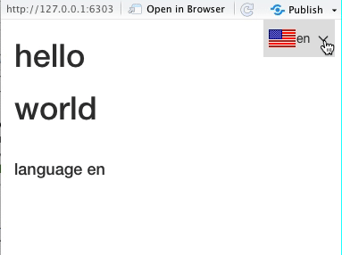

<!-- README.md is generated from README.Rmd. Please edit that file -->

# shi18ny

<!-- badges: start -->

<!-- badges: end -->

Shiny apps internationalization: same app, multiple languages.

We want to make data science more accessible and more inclusive for
those people who don’t speak English as their first language. `shi18ny`
enables you to translate your Shiny apps into 15 (and growing) different
languages so that you can reach coders and non-coders around the world
with little effort.

Check the full documentation at <http://shi18ny.datasketch.dev>



## Languages

Currently, `shi18ny` supports the following 15 languages: Arabic,
Catalan, Chinese, Danish, German, English, Spanish, French, Hebrew,
Hindi, Italian, Portuguese, Portuguese (Brazil), Russian, and Swedish.

If the language you’re looking for is not yet available, see the
`vignette("contributing")` on how you can help us improve and extend the
selection languages.

## Installation

You can install the development version from
[GitHub](https://github.com/) with:

``` r
# install.packages("devtools")
devtools::install_github("datasketch/shi18ny")
```

For more installation advice, for example if you want to contribute to
the package, see the `vignette("getting-started")` guide.

## Your first multilanguage shiny app

Here is a basic example which shows you how to use `shi18ny` in a basic
Shiny app.

``` r
if (interactive()) {
  
  library("shiny")
  library("shi18ny")
  
  ui <- fluidPage(
    tags$h1("shiny internationalization"),
    
    br(),
    # Initialize shi18ny
    useShi18ny(),
    
    # Language selector input
    langSelectorInput("lang", position = "fixed"),
    
    # UI elements
    # Text can be translated directly from the UI, using the ui_ function:
    h1(ui_("hello")),
    # OR by using uiOutput:
    uiOutput("results")
    
  )
  
  server <- function(input, output, session) {
    # Configure shi18ny
    i18n <- list(
      defaultLang = "en",
      availableLangs = c("es", "en", "pt")
    )
    
    # Call language module to get currently selected language and save it in a reactive
    lang <- callModule(langSelector, "lang", i18n = i18n, showSelector = TRUE)
    
    # Update UI translation
    observeEvent(lang(),{
      uiLangUpdate(input$shi18ny_ui_classes, lang())
      })
    
    # Render translations by passing the text and the active (selected) language as the lang() parameter to the i_ function
    output$results <- renderUI({
      list(
        h1(i_("world", lang())), 
        br(), 
        h4(i_("language", lang()))
        )
      })
  }
  
  shinyApp(ui, server)
  
}
```

## More examples

You can find more examples by running `shi18ny::runExample()` after
installing the package. This will show you the names of the examples
that are available.

For example, you can run
`shi18ny::runExample("ex06-translate_covid_viz")` to see how `shi18ny`
can be used to translate a map of the world showing confirmed cases of
COVID-19 by country (as of 08/07/20).


## Roadmap

We are always looking to improve `shi18ny` to further promote the
internationalization of data science. Here are some
improvements/features we have on our list for upcoming releases. If you
have any other suggestions for new features, please let us know by
filing an issue as a ‘feature request’ on our GitHub page (see
`vignette("contributing")` for details).

  - Support RTL languages properly
  - Add locale formatting for dates
  - …

## Other internationalization packages

If you’re interested in other R packages around the topic of
internationalization in R, have a look at the following GitHub pages:

  - [shiny.i18n](https://github.com/Appsilon/shiny.i18n) (for more Shiny
    internationalization)
  - [traduire](https://github.com/reside-ic/traduire) (for translations
    outside of Shiny apps)
  - [i18n](https://github.com/rich-iannone/i18n/) (to get localized
    variants of dates, times, and currencies)
  - [d3.format](https://github.com/dreamRs/d3.format) (to format numbers
    for human consumption)

## FAQ

### I’ve spotted a bug, how can I report it?

If you’ve come across issues with the package, we’d greatly appreciate
if you could file an issue on our GitHub page. See the
`vignette("contributing")` guide on how to go about that.

### My language is not yet supported, what can I do to help?

If you are looking to translate your Shiny app into a language that
doesn’t yet exist in `shi18ny` you can either make a feature request for
this language on our GitHub page or help us add this language to the
dictionary. In the `vignette("contributing")` we take you through the
steps.

### My language exists but doesn’t recognize certain words, how can I solve this?

If the language you are using for your translation is supported by
`shi18ny` but there are certain words that aren’t translated (or that
aren’t translated correctly) you can help by filing this as an issue or
by helping us improve the dictionary yourself. The
`vignette("contributing")` talks you through either of these options.

# Acknowledgements

## Flags from

Country Flags taken from <https://github.com/hjnilsson/country-flags>
Catalonia flag from
[wikipedia](https://meta.wikimedia.org/wiki/File:Flag_of_Catalonia.svg)
